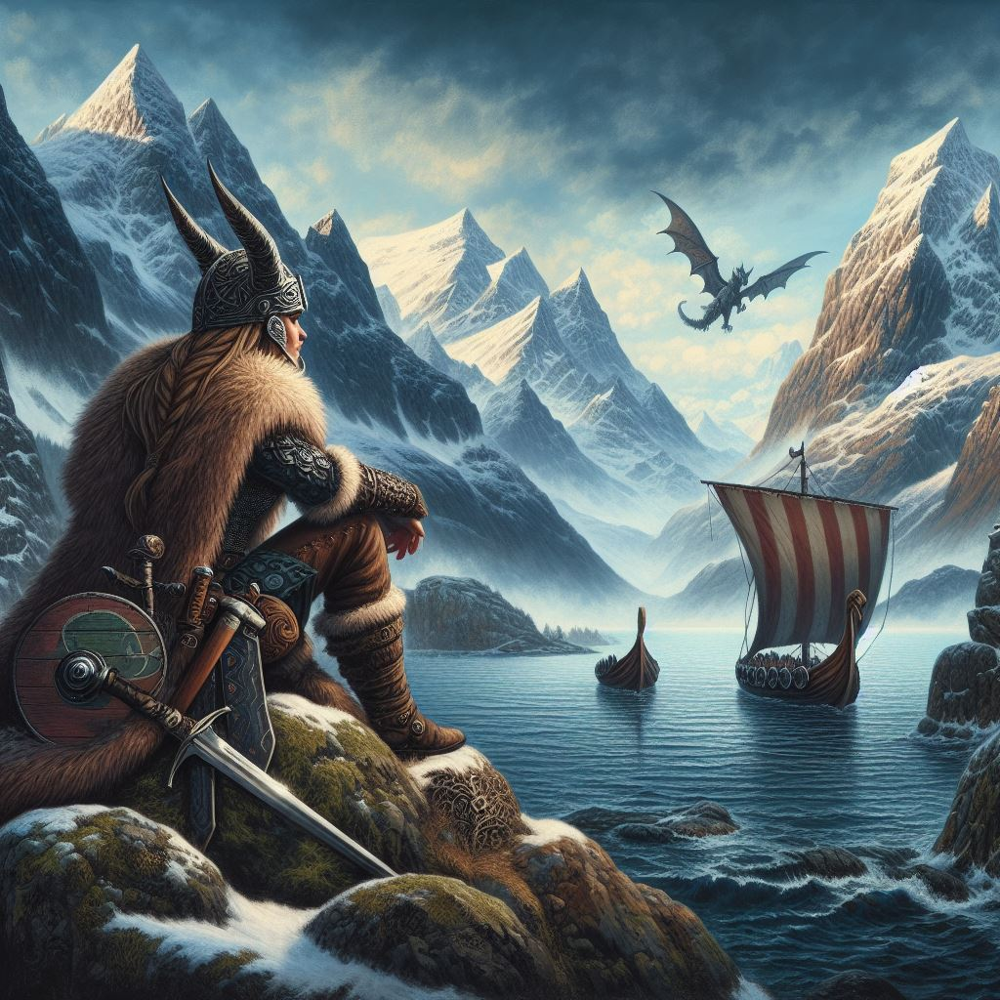
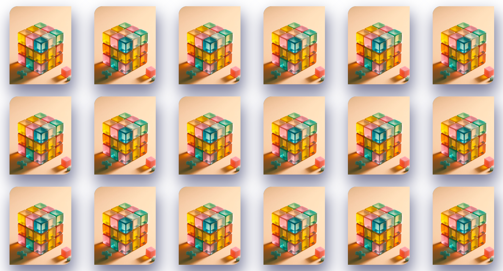
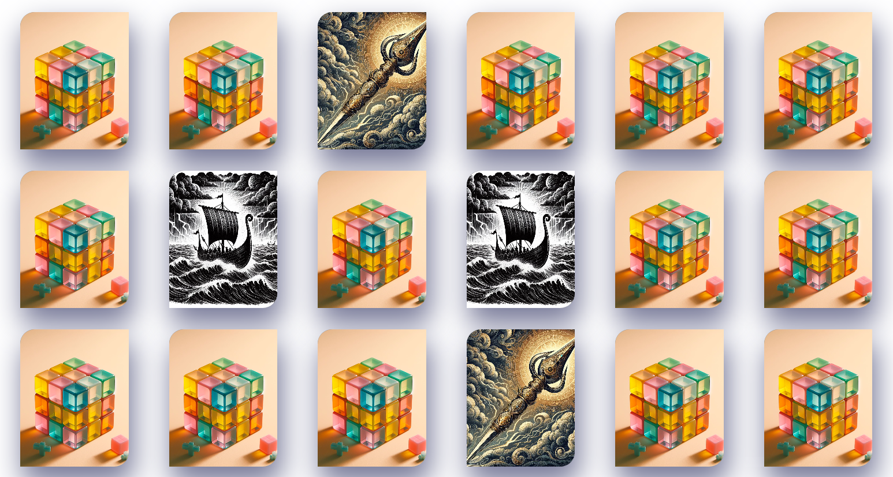

# Memoria Nórdica

Te embarcarás en un viaje único, donde la memoria se convierte en tu mayor aliada. El juego de cartas Memoria Nórdica desafiará tu destreza mental mientras encuentras las parejas de símbolos vikingos iguales para completar el tablero.

## Objetivo del Juego

Encuentra las parejas de símbolos vikingos iguales para completar el tablero y demostrar tu destreza en la memoria. Haz clic en el botón de shuffle para iniciar un nuevo juego.

## Instrucciones de Uso

- Haz clic en las cartas para voltearlas.
- Encuentra las parejas de símbolos idénticos.
- Utiliza el botón de shuffle para iniciar un nuevo juego.

## Capturas de Pantalla

Inicio del Juego

Encuentra los símbolos

## Instalación

1. Clona el repositorio.
2. Instala las dependencias con `npm install`.
3. Ejecuta la aplicación con `npm start`.

## Colaboración

Si deseas contribuir al proyecto, sigue estos pasos:
1. Fork del repositorio.
2. Crea una rama con un nombre descriptivo.
3. Realiza tus cambios y crea un pull request.

## Contacto

tacs.laboral@gmail.com 
www.linkedin.com/in/tamara-contreras

## Agradecimientos

imágenes: https://www.bing.com/images/create?
Al equipo de Laboratoria por su apoyo eterno: www.laboratoria.la <3
A mis padres <3 
Much@s amigos y conocid@s que me motivaron a que persistiera.
